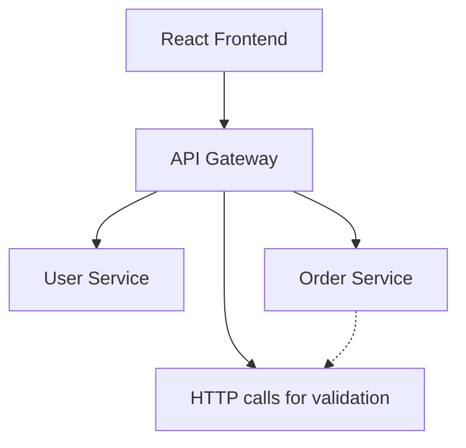

## Service-Level Documentation

Each service in `services/<service-name>/` must have a `README.md` containing:

- **Purpose**: What the service does (1-2 sentences)
- **API Endpoints**: Table with Method, Path, Description, Auth required?
- **Local Setup**: Step-by-step commands to run locally
- **Environment Variables**: List all required `.env` variables with descriptions
- **Example Requests**: curl or Postman examples for key endpoints
- **Health Check**: Explain `/health` endpoint
- **Testing**: How to run tests for this service

Example structure:
```markdown
# User Service

Handles user authentication and authorization.

## API

| Method | Path | Description | Auth |
|--------|------|-------------|------|
| POST | /sign-up | Register new user | No |
| POST | /login | Authenticate user | No |
| GET | /users | List all users | Yes (Admin) |

## Setup

\`\`\`bash
cd services/user-service
npm install
cp .env.example .env
# Edit .env with your values
npm start
\`\`\`

## Environment Variables

- \`PORT\` - Service port (default: 3001)
- \`MONGODB_URI\` - MongoDB connection string
- \`DATABASE_NAME\` - Database name
- \`JWT_SECRET\` - Secret for signing tokens

## Health Check

GET /health returns service status.

## Tests

\`\`\`bash
npm test
\`\`\`
```

## Project-Level Documentation

**ARCHITECTURE.md**: Explain the microservices design.
- Why microservices for this project?
- Service boundaries and responsibilities
- Data flow between services
- API Gateway pattern
- Database-per-service pattern
- Service-to-service communication (axios, retries)
- Include Mermaid diagram:


**API.md**: Document all endpoints across all services.
- Group by service
- Include request/response examples with sample JSON
- Mention headers (Content-Type, Authorization)
- Document error responses with status codes

**README.md** (root): Portfolio-ready landing page.
- Badges: build status, license, code coverage
- Feature list (bullet points)
- Tech stack table (Frontend, Backend, Database, DevOps, Testing)
- Screenshots/GIFs of the app
- Quick start: \`docker-compose up\`
- "Why this project?" section explaining architectural decisions
- Links to ARCHITECTURE.md and API.md

## Documentation Principles

- Keep examples current; update when endpoints change
- Show actual request/response payloads, not just descriptions
- Include curl commands for CLI testing
- Use proper Markdown formatting (code blocks, tables, headers)
- Document environment variables in every relevant README
- Assume reader is a developer setting up the project
